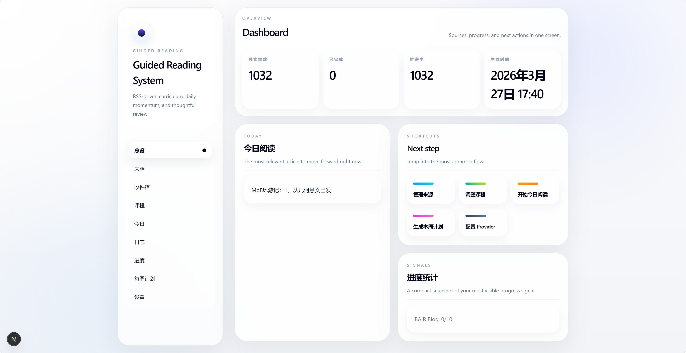
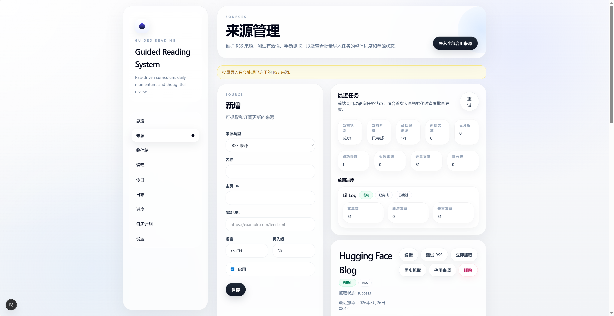
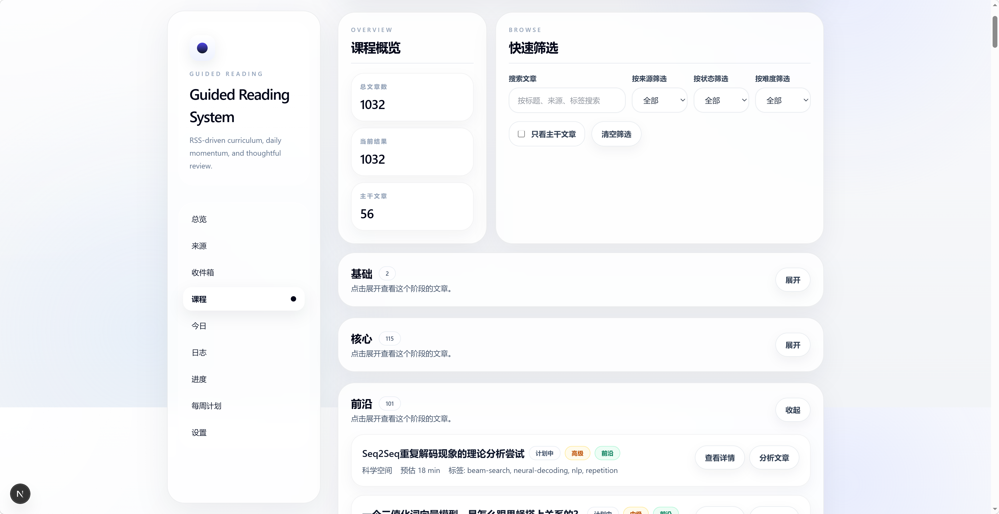
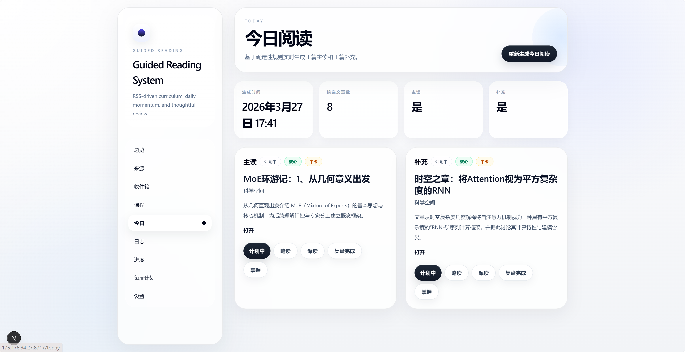
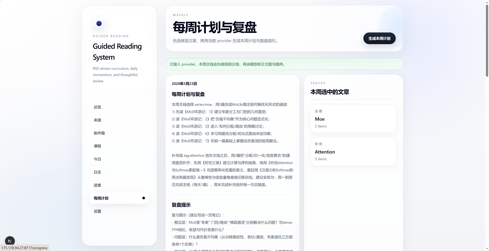

# Guided Reading System

[中文](#中文) | [English](#english)

Turn scattered articles into a guided reading workflow with curriculum staging, daily reading, weekly planning, progress tracking, and optional OpenAI-compatible provider support.

## Screenshots

| Dashboard | Sources |
| --- | --- |
|  |  |

| Curriculum | Today |
| --- | --- |
|  |  |

| Weekly |
| --- |
|  |

## 中文

### 项目简介

`Guided Reading System` 是一个面向自部署场景的单用户阅读推进系统。

它不是“猜你喜欢”的推荐器，而是把一批零散文章组织成可持续推进的阅读课程，并支持：

- RSS 来源管理
- 手动来源与文本批量导入
- 课程编排与阅读推进
- 今日阅读与每周计划
- 阅读记录与进度统计
- 接入任意 OpenAI-compatible provider 做文章分析和周计划辅助

### 当前能力

- 来源管理
  - RSS 来源 CRUD
  - `manual / rss` 两类来源
  - 手动来源后续可补填 `rss_url` 升级为可订阅来源
  - RSS 测试、单源抓取、批量抓取
- 文章导入
  - RSS 导入
  - 手动单篇录入
  - 文本批量导入
    - 支持 `.txt / .md / .csv`
    - 支持直接粘贴文本
    - 先预览再导入
    - 可绑定已有来源或新建手动来源
- 课程与推进
  - `foundation / core / frontier / update`
  - `planned / skimmed / deep_read / reviewed / mastered`
  - `/curriculum` 编辑课程字段
  - `/today` 展示主读 + 补充
  - `/weekly` 展示本周主线、补充线、计划与复盘
  - `/log` 记录阅读日志
  - `/progress` 展示聚合进度
- LLM 集成
  - 支持 OpenAI-compatible provider
  - provider 未配置时，基础功能仍可用
  - provider 已配置时，可用于：
    - 文章分析
    - 文本导入兜底解析
    - 每周课程编排与计划生成

### 技术栈

- 前端：Next.js + TypeScript + Tailwind CSS
- 后端：FastAPI + SQLModel
- 数据库：SQLite
- RSS：`feedparser`
- 模型接入：OpenAI-compatible provider
- 部署：Docker Compose

### 目录结构

- `frontend/`：Next.js 应用
- `backend/`：FastAPI 应用
- `docker-compose.yml`：本地和服务器部署入口

### 主要页面

- `/sources`：来源管理、RSS 测试、抓取、批量任务进度
- `/inbox`：未编排文章、手动录入、文本批量导入
- `/curriculum`：课程编排与字段修正
- `/today`：今日阅读
- `/weekly`：每周计划与复盘
- `/log`：阅读日志
- `/progress`：进度统计
- `/settings`：Provider 设置

### 阅读模型

- 阶段 `stage`
  - `foundation`：背景、入门、前置知识
  - `core`：主干、系统性、必读内容
  - `frontier`：更深入、更前沿
  - `update`：更新、动态、跟进材料
- 状态 `status`
  - `planned`
  - `skimmed`
  - `deep_read`
  - `reviewed`
  - `mastered`

### 本地开发

#### 1. 启动后端

```powershell
cd backend
python -m venv .venv
.\.venv\Scripts\activate
pip install -r requirements.txt
python -m app.seed
uvicorn app.main:app --reload
```

后端默认地址：`http://localhost:8000`

#### 2. 启动前端

```powershell
cd frontend
npm install
npm run dev
```

前端默认地址：`http://localhost:3000`

前端会通过 `/backend-api/*` 代理到后端。

### 环境变量

- `BACKEND_INTERNAL_URL`
- `NEXT_PUBLIC_API_BASE_URL`
- `BACKEND_CORS_ORIGINS`
- `DATABASE_URL`
- `APP_ENV`

### 种子数据

执行下面命令会插入默认 demo 来源：

- Hugging Face Blog
- Lil'Log
- BAIR Blog
- 科学空间

```powershell
cd backend
.\.venv\Scripts\python -m app.seed
```

### 质量检查

#### 后端

```powershell
cd backend
.\.venv\Scripts\python -m pytest
```

#### 前端

```powershell
cd frontend
npm run lint
npm run build
```

### Docker 部署

本地或 Ubuntu / Debian 服务器均可直接使用：

```bash
docker compose up --build -d
```

服务地址：

- 前端：`http://localhost:3000`
- 后端：`http://localhost:8000`

SQLite 数据会保存在命名卷 `backend_data` 中。

### Git 推送到服务器部署

典型流程：

```bash
git pull
docker compose up --build -d
```

如果只是机器重启、代码没变，直接：

```bash
docker compose up -d
```

### 当前限制

- 单用户
- 无登录注册
- 不抓全文
- 不做浏览器爬虫
- 不做个性化推荐
- API Key 当前保存在 SQLite 的 `app_settings` 表中，适合自部署场景，不是高安全方案

---

## English

### Overview

`Guided Reading System` is a self-hosted, single-user reading workflow app.

It is not a preference-based recommender. Instead, it helps you turn scattered articles into a guided reading curriculum with:

- RSS source management
- Manual sources and batch text import
- Curriculum staging
- Daily reading and weekly plans
- Reading logs and progress tracking
- Optional OpenAI-compatible provider integration for analysis and planning

### Current Features

- Source management
  - Full CRUD for RSS sources
  - `manual` and `rss` source types
  - Manual sources can later be upgraded by adding an `rss_url`
  - RSS validation, single-source fetch, and batch fetch
- Article ingestion
  - RSS import
  - Manual single-article entry
  - Batch text import
    - `.txt / .md / .csv`
    - direct paste supported
    - preview before import
    - bind to an existing source or create a new manual source
- Curriculum and workflow
  - `foundation / core / frontier / update`
  - `planned / skimmed / deep_read / reviewed / mastered`
  - `/curriculum` for editing reading metadata
  - `/today` for primary + supplemental reading
  - `/weekly` for weekly tracks, plan, and review
  - `/log` for reading logs
  - `/progress` for aggregated progress
- LLM integration
  - OpenAI-compatible providers only
  - Core features still work without provider credentials
  - When configured, the provider can be used for:
    - article analysis
    - text-import fallback parsing
    - weekly curriculum planning

### Stack

- Frontend: Next.js + TypeScript + Tailwind CSS
- Backend: FastAPI + SQLModel
- Database: SQLite
- RSS ingestion: `feedparser`
- Model integration: OpenAI-compatible provider
- Deployment: Docker Compose

### Repository Layout

- `frontend/`: Next.js application
- `backend/`: FastAPI application
- `docker-compose.yml`: local/server deployment entrypoint

### Main Pages

- `/sources`: source management, RSS validation, fetching, batch job progress
- `/inbox`: unassigned articles, manual entry, batch text import
- `/curriculum`: curriculum editing
- `/today`: daily reading
- `/weekly`: weekly plan and review
- `/log`: reading log
- `/progress`: progress dashboard
- `/settings`: provider settings

### Reading Model

- `stage`
  - `foundation`: intro, background, prerequisites
  - `core`: central, must-read, systematic material
  - `frontier`: deeper, more advanced, more cutting-edge
  - `update`: ongoing updates and follow-ups
- `status`
  - `planned`
  - `skimmed`
  - `deep_read`
  - `reviewed`
  - `mastered`

### Local Development

#### 1. Start the backend

```powershell
cd backend
python -m venv .venv
.\.venv\Scripts\activate
pip install -r requirements.txt
python -m app.seed
uvicorn app.main:app --reload
```

Backend runs on `http://localhost:8000`.

#### 2. Start the frontend

```powershell
cd frontend
npm install
npm run dev
```

Frontend runs on `http://localhost:3000`.

The frontend proxies `/backend-api/*` to the FastAPI backend.

### Environment Variables

- `BACKEND_INTERNAL_URL`
- `NEXT_PUBLIC_API_BASE_URL`
- `BACKEND_CORS_ORIGINS`
- `DATABASE_URL`
- `APP_ENV`

### Seed Data

The seed script inserts demo sources if they do not already exist:

- Hugging Face Blog
- Lil'Log
- BAIR Blog
- Kexue.fm

```powershell
cd backend
.\.venv\Scripts\python -m app.seed
```

### Checks

#### Backend

```powershell
cd backend
.\.venv\Scripts\python -m pytest
```

#### Frontend

```powershell
cd frontend
npm run lint
npm run build
```

### Docker Deployment

For local production-like startup or an Ubuntu / Debian server:

```bash
docker compose up --build -d
```

Exposed services:

- Frontend: `http://localhost:3000`
- Backend: `http://localhost:8000`

SQLite data is stored in the named volume `backend_data`.

### Git-to-Server Deployment Flow

Typical server flow:

```bash
git pull
docker compose up --build -d
```

If the machine only restarted and the code did not change:

```bash
docker compose up -d
```

### Current Limitations

- Single-user only
- No auth
- No full-text crawling
- No browser-based scraping
- No personalized recommendation engine
- The API key is currently stored in the SQLite `app_settings` table, which is acceptable for self-hosting but not a hardened secret-management setup
